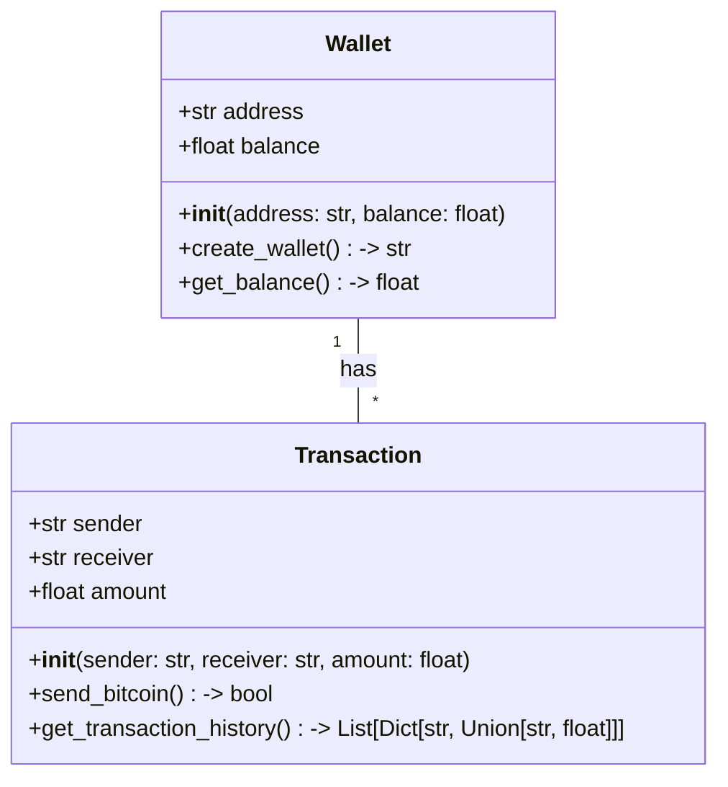
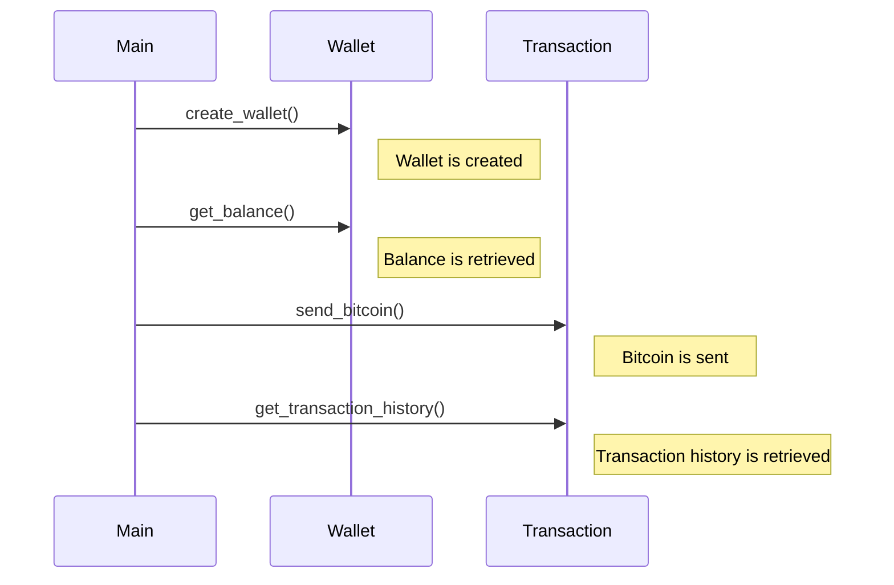

## Implementation approach
Given the requirement of creating a Bitcoin wallet with functionalities similar to Electrum, we will use the Bitcoin Core's RPC interface for the backend and Flask for the frontend. Bitcoin Core's RPC interface allows us to interact with the Bitcoin network, while Flask provides a lightweight framework for the frontend. We will also use SQLite for local data storage. The wallet will be implemented as a web application, which can be accessed through a web browser on any platform.

## Python package name
```python
"bitcoin_wallet"
```

## File list
```python
[
    "main.py",
    "wallet.py",
    "transaction.py",
    "database.py",
    "templates/index.html",
    "templates/transaction.html",
    "templates/wallet.html",
    "static/css/main.css",
    "README.md"
]
```

## Data structures and interface definitions


## Program call flow


## Anything UNCLEAR
The requirement is clear to me. However, the implementation details such as how to interact with the Bitcoin network and how to secure the wallet will depend on the specific libraries and tools used.